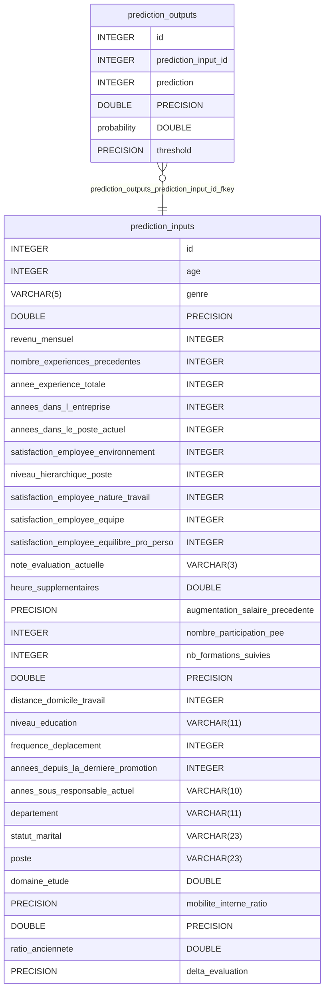

---
title: Futurisys
emoji: 🧠
colorFrom: blue
colorTo: indigo
sdk: docker
sdk_version: "1.0"
app_file: app.py
pinned: false
---


# OC## Features

-   🚀 **FastAPI** - Modern, fast web framework for building APIs
-   🗄️ **SQLAlchemy ORM** - Powerful database ORM for Python
-   📝 **Pydantic** - Data validation using Python type annotations
-   🐍 **Pyenv Environment** - Isolated Python environment management
-   🔧 **Environment Variables** - Configuration via .env files
-   🔒 **Git Security** - Proper .gitignore for sensitive filesURISYS_Deploy_a_model

A simple FastAPI application for ML model deployment with environment variable support.

## Features

-   🚀 **FastAPI** - Modern, fast web framework for building APIs
-   🗄️ **SQLAlchemy ORM** - Powerful database ORM for Python
-   📝 **Pydantic** - Data validation using Python type annotations
-   🐍 **Pyenv Environment** - Isolated Python environment management
-   � **RESTful API** - Clean API structure with proper HTTP methods


## ERD



## Project Structure

```
├── app/
│   ├── api/
│   │   ├── __init__.py
│   │   └── endpoints.py             # All API endpoints with router
│   ├── __init__.py
│   ├── main.py                      # FastAPI application entry point
│   ├── models.py                    # SQLAlchemy models
│   └── schemas.py                   # Pydantic schemas
├── .env                             # Environment variables (not in git)
├── .env.example                     # Environment template (in git)
├── .gitignore                       # Git ignore rules
├── .python-version                  # Pyenv version file
├── requirements.txt                 # Python dependencies
└── README.md                        # This file
```

## Setup

### 1. Python Environment (Pyenv)

The project uses pyenv for Python environment management:

```bash
# Navigate to project directory (pyenv will auto-activate)
cd /Users/xaviercoulon/Documents/OC/OC_P5_Futurisys

# Verify environment is active
pyenv version
# Should show: OC_P5_Futurisys (set by .python-version)
```

### 2. Install Dependencies

```bash
pip install -r requirements.txt
```

### 3. Environment Configuration

```bash
# Copy example environment file
cp .env.example .env

# Edit .env file with your configuration
nano .env
```

**Important**: The `.env` file contains sensitive information and is not tracked by git.

## Running the Application

### Start the Development Server

```bash
# Using FastAPI CLI (recommended)
fastapi dev app/main.py

# Or using uvicorn directly
python -m uvicorn app.main:app --reload --port 8000
```

The API will be available at:

-   **API**: http://127.0.0.1:8000
-   **Interactive Documentation**: http://127.0.0.1:8000/docs
-   **Alternative Documentation**: http://127.0.0.1:8000/redoc

### Test the API

```bash
# Start the development server
fastapi dev app/main.py

# Test manually with curl
curl -X GET "http://127.0.0.1:8000/v1/"
curl -X GET "http://127.0.0.1:8000/v1/health"
curl -X GET "http://127.0.0.1:8000/v1/info"
curl -X GET "http://127.0.0.1:8000/v1/status"
```

## API Endpoints

### Main Routes (v1 prefix)

-   **GET** `/v1/` - Root endpoint with welcome message
-   **GET** `/v1/health` - Check API health status
-   **GET** `/v1/info` - Get API information
-   **GET** `/v1/status` - Get API status with database check

### Example Response

```json
{
    "message": "Futurisys API is running",
    "data": {
        "version": "1.0.0",
        "description": "Futurisys web API",
        "project_name": "Futurisys API"
    },
    "timestamp": "2025-10-07T16:20:00.000000"
}
```

## Environment Variables

The application uses environment variables for configuration. Copy `.env.example` to `.env` and customize:

```env
# Environment Configuration
DEBUG=True
ENVIRONMENT=development

# Database
DATABASE_URL=sqlite:///./futurisys.db

# API Configuration
API_TITLE=Futurisys ML API
API_DESCRIPTION=Simple ML model deployment API
API_VERSION=1.0.0

# Security
SECRET_KEY=your-secret-key-change-this-in-production

# Server Configuration
HOST=0.0.0.0
PORT=8000

# Logging
LOG_LEVEL=INFO
```

## Key Technologies

### FastAPI

-   Fast and modern web framework
-   Automatic API documentation
-   Built-in data validation
-   Async support

### SQLAlchemy

-   Python SQL toolkit and ORM
-   Database abstraction layer
-   Migration support with Alembic

### Pydantic

-   Data validation using Python type annotations
-   Automatic JSON schema generation
-   Configuration management

### Pyenv

-   Python version management
-   Virtual environment isolation
-   Automatic environment activation

## Development

### Install Additional Packages

```bash
pip install package_name
pip freeze > requirements.txt  # Update requirements
```

### Database Migrations (when needed)

```bash
# Initialize Alembic
alembic init migrations

# Create migration
alembic revision --autogenerate -m "description"

# Apply migration
alembic upgrade head
```

### Testing

```bash
# Run tests
pytest

# Run with coverage
pytest --cov=app
```

## Production Deployment

For production deployment, consider:

1. **Environment Variables**: Use proper secrets management
2. **Database**: Switch from SQLite to PostgreSQL/MySQL
3. **WSGI Server**: Use Gunicorn with Uvicorn workers
4. **Reverse Proxy**: Use Nginx or similar
5. **Containerization**: Docker deployment
6. **Monitoring**: Add logging and monitoring

## Next Steps

1. **Add Database Models**: Create SQLAlchemy models for your data
2. **Implement Authentication**: Add JWT-based authentication
3. **Expand API**: Add business logic endpoints
4. **Monitoring**: Add logging and metrics
5. **Testing**: Expand test coverage
6. **Documentation**: Add more detailed API documentation
